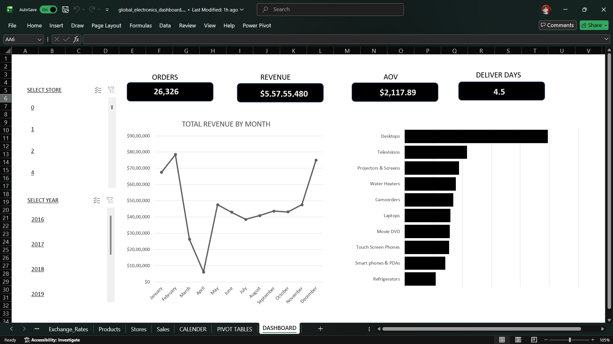
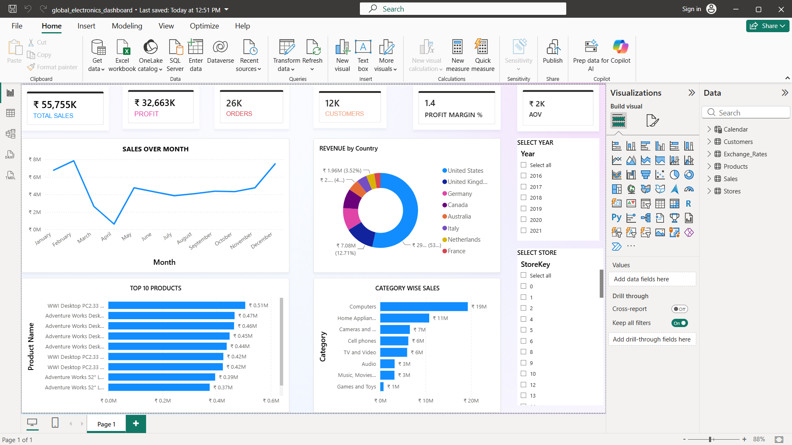
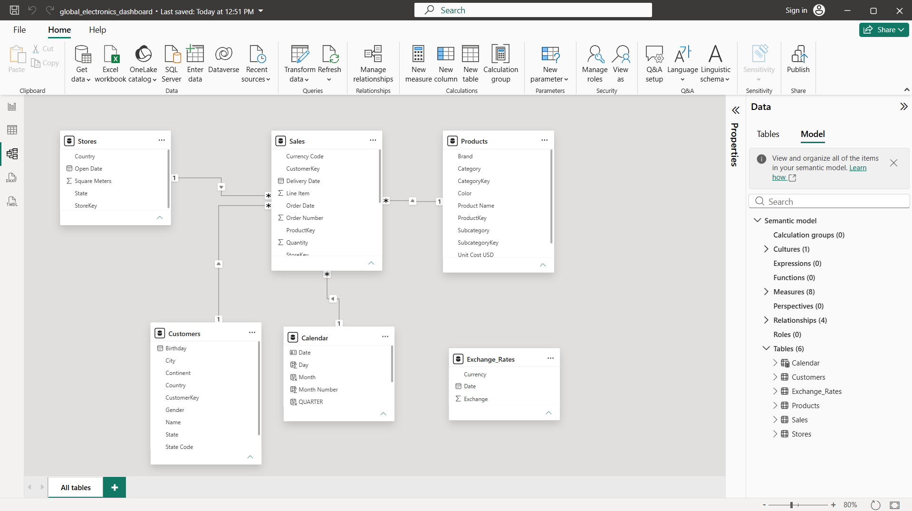

# 📊 Global Electronics Sales Analytics

An interactive business analytics project developed using **Microsoft Excel** and **Power BI** to analyze sales performance, customer behavior, product performance, and regional trends for a global electronics retailer.

---

## 📌 Project Overview

This project analyzes transactional sales data from a global electronics retailer and transforms it into interactive dashboards using Excel and Power BI.

The dashboards provide key business insights into revenue, profit, customers, product categories, countries, and sales trends, enabling decision-makers to monitor performance and identify growth opportunities.

---

## 🎯 Business Objectives

The project aims to answer business questions such as:

- What is the overall sales performance?
- Which countries generate the highest revenue?
- Which products contribute the most sales?
- How do sales change over time?
- What is the Average Order Value (AOV)?
- Which stores perform the best?

## 🛠️ Tools & Technologies

- Microsoft Excel
- Power BI
- Power Query
- DAX (Data Analysis Expressions)
- Git
- GitHub

## 📂 Dataset

The project uses a multi-table retail dataset containing information about:

- Customers
- Products
- Sales Transactions
- Stores
- Exchange Rates

 DATASET SOURCE - https://mavenanalytics.io/data-playground/global-electronics-retailer?utm_source=google.com

The dataset was imported from multiple CSV files and modeled using relationships in Power BI to create a structured analytical model.

## 📊 Dashboard Features

### KPI Metrics

- Total Sales
- Total Profit
- Total Orders
- Total Customers
- Average Order Value (AOV)

### Visualizations

- Monthly Sales Trend
- Top Selling Products
- Revenue by Country
- Category-wise Sales
- Interactive Year Filter
- Store Filter

### Power BI Features

- Power Query for data transformation
- Data Modeling with table relationships
- DAX Measures
- Interactive slicers and filters

### Excel Features

- Pivot Tables
- Pivot Charts
- Slicers
- Interactive Dashboard

## 🖼️ Dashboard Preview

### Microsoft Excel Dashboard

---

### Power BI Dashboard

---

### Data Model

## 📈 Key Business Insights

- Built KPI dashboards to monitor Total Sales, Profit, Orders, Customers, and Average Order Value (AOV).
- Identified top-performing products and product categories based on revenue.
- Analyzed monthly sales trends to understand seasonal business performance.
- Compared sales performance across different countries.
- Enabled interactive analysis using Year and Store filters.
- Built dashboards that allow users to explore business performance from multiple perspectives.

## 💼 Skills Demonstrated

### Microsoft Excel

- Data Cleaning
- Pivot Tables
- Pivot Charts
- Slicers
- Dashboard Design
- KPI Reporting

### Power BI

- Power Query
- Data Modeling
- DAX Measures
- Relationships
- Interactive Dashboards

### Business Analytics

- Sales Analysis
- Product Performance Analysis
- Geographic Analysis
- Trend Analysis
- KPI Development
- Business Reporting

## 📁 Repository Structure
global-electronics-sales-analytics/
│
├── README.md
├── LICENSE
├── .gitignore
│
├── dataset/
│   ├── dataset_info.md
│   └── *.csv
│
├── excel/
│   └── Global_Electronics_Dashboard.xlsx
│
├── powerbi/
│   └── Global_Electronics_Dashboard.pbix
│
├── images/
│   ├── excel_dashboard.png
│   ├── powerbi_dashboard.png
│   └── data_model.png
│
└── insights.md

## 🚀 Future Improvements

- Add advanced drill-through reports.
- Build executive and operational dashboard pages.
- Include customer segmentation analysis.
- Add forecasting and trend prediction.
- Expand KPI reporting with additional business metrics.

## 🙏 Acknowledgements

This project was created as part of my Data Analytics portfolio to demonstrate practical skills in Excel, Power BI, dashboard development, and business analytics.

# Project Insights

## Business Questions Answered

- How much revenue did the business generate?
- Which products contribute the highest sales?
- Which countries generate the highest revenue?
- How do sales change over time?
- Which stores perform the best?
- What is the Average Order Value (AOV)?

## Analytical Techniques Used

- KPI Reporting
- Trend Analysis
- Product Performance Analysis
- Geographic Sales Analysis
- Interactive Dashboarding

## Dashboard Capabilities

- Dynamic filtering by Year
- Dynamic filtering by Store
- Interactive KPI monitoring
- Sales trend visualization
- Product comparison
- Country-level analysis

👨‍💻 Author
Sanjesh Yazali

Aspiring Data Analyst

Skills:

SQL
Excel
Power BI
Data Analytics

